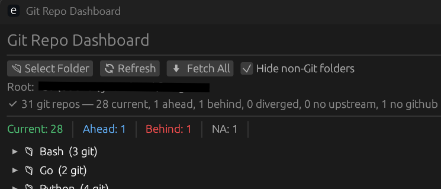

# Git Repo Dashboard

I wanted something to give a quick snapshot of my project folders and their git statuses so I could minimize my merge issues. So here is a fast, lightweight desktop app for scanning and monitoring multiple Git repositories at once.

## Features

* Scan a root folder for repositories (depth 2)
* Parallel scanning using Rayon for speed
* Fetch all remotes across repos with one click
* Status overview:
  * Current
  * Ahead
  * Behind
  * Diverged
  * No Upstream
* Smart grouping by folder
* Detects GitHub repos automatically
* Option to hide non-Git folders
* Click-to-open folders in your OS file manager
* Color-coded statuses for quick visual feedback

## UI overview

* Top bar: Select folder, refresh, fetch all
* Summary counts: Quick counts of repo states
* Grouped view: Repos organized by parent folder
* Status table:
  * Folder name (clickable)
  * Git presence
  * GitHub detection
  * Status (color-coded)

## Usage

1. Click 📂 Select Folder
2. Choose a root directory containing projects
3. Browse grouped repositories
4. Use:  
  🔄 Refresh to rescan  
  ⬇ Fetch All to update remotes
5. Click any repo name to open it

## Status overview

Each repo is categorized as:

Status     |Color |Meaning
|----------|------|-----|
Current    |${\textsf{\color{green}Green}}$|Local and remote are in sync
Ahead      |${\textsf{\color{blue}Blue}}$  |Local has commits not pushed
Behind     |${\textsf{\color{red}Red}}$   |Remote has commits not pulled
Diverged   |${\textsf{\color{yellow}Yellow}}$|Both local and remote have unique commits
No Upstream|${\textsf{\color{purple}Purple}}$|Branch has no upstream tracking
NA         |${\textsf{\color{gray}Gray}}$  |Could not determine status
Non-Git    |${\textsf{\color{gray}Gray}}$  |Not a Git repository
